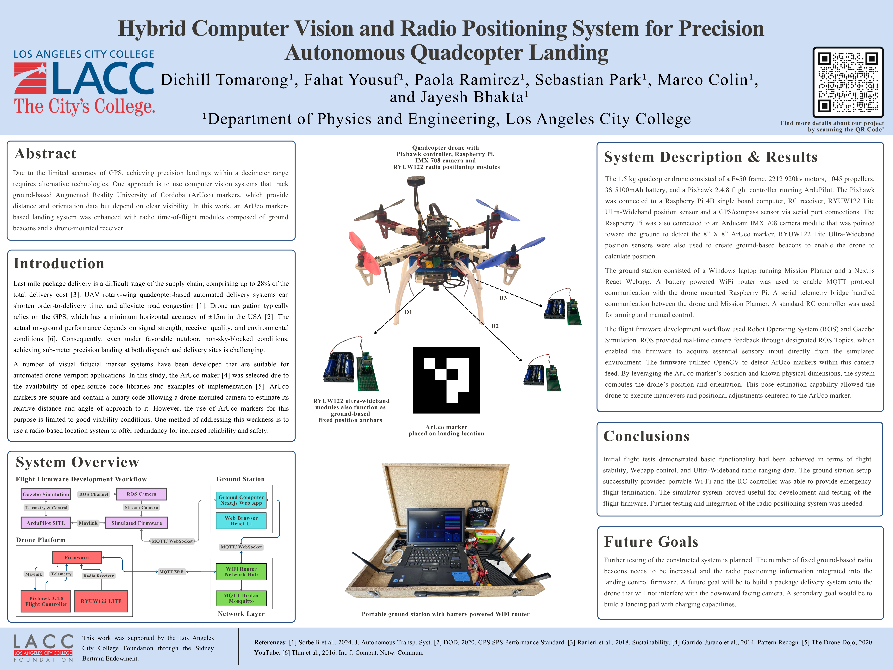

# LACC Drone Project

**Team Members**: 
- [Dichill Tomarong](https://www.linkedin.com/in/dichill/)
- [Fahat Yousuf](https://www.linkedin.com/in/fahatyousuf/)
- [Paola Ramirez](https://www.linkedin.com/in/paolaramirezcs/)
- [Sebastian Park](https://www.linkedin.com/in/sebastian-park-0639a4376/)
- Marco Colin

**Under the Guidance of**: Professor Jayesh Bhakta

---

A precision landing drone system featuring ArUco marker detection and a modern web-based ground control station. This project supports both real hardware deployment and ROS Gazebo simulation for development and testing.

## SCCUR Conference Poster



## System Architecture

### Real Hardware System

The system uses a Raspberry Pi companion computer connected to a Pixhawk flight controller for autonomous precision landing.


### ROS Simulation System

For testing and development, the system can be run in a ROS Gazebo simulation environment.


### Key Differences

| Feature | ROS Simulation | Real Hardware |
|---------|----------------|---------------|
| **Camera** | Gazebo virtual camera → ROS topic | Raspberry Pi Camera → Picamera2 |
| **Connection** | TCP socket (127.0.0.1:5763) | Serial UART (/dev/serial0) |
| **Flight Controller** | SITL (Software in the Loop) | Physical Pixhawk/ArduPilot |
| **Communication** | DroneKit wrapper | Direct PyMAVLink |
| **Environment** | Virtual 3D world | Real world flight |

## Demo

### Web Interface Demo

Watch our web-based ground control station controlling the drone in ROS Gazebo simulation:

[](https://youtu.be/kPHsVJfyG78)

[▶ View Demo Video](https://youtu.be/kPHsVJfyG78)

### Development Timelapse

Watch the journey of building this drone from start to finish:

[](https://youtu.be/sDJA-0r_t70)

[▶ View Timelapse](https://youtu.be/sDJA-0r_t70)

## Project Structure

```
LACCDRONE/
├── drone-client/
│   ├── main.py                      # Flight controller (real hardware)
│   ├── main_ros_sim.py              # Flight controller (ROS simulation)
│   ├── camera_streamer.py           # Camera streamer (real hardware)
│   └── camera_streamer_ros_sim.py   # Camera streamer (ROS simulation)
│
└── ground-station/
    ├── app/                         # Next.js pages
    ├── components/                  # React components
    └── hooks/                       # Custom React hooks
```

## Features

- **Precision Landing** - ArUco marker-based landing guidance
- **Manual Control** - Web-based manual flight controls
- **Real-time Telemetry** - Live flight data and status
- **Video Streaming** - Real-time camera feed with marker overlay
- **Ground Station** - Modern web interface for drone control

## Technologies

- **Flight Control**: PyMAVLink, ArduPilot
- **Vision**: OpenCV, ArUco markers, Picamera2
- **Communication**: MQTT, WebSockets
- **Ground Station**: Next.js, React, TypeScript
- **Simulation**: ROS, Gazebo, DroneKit

## Installation & Setup

### 🚁 Drone Client (Raspberry Pi)

#### 1. Flash Raspberry Pi OS

Flash **Raspberry Pi OS (Legacy, 32-bit)** for compatibility with MAVLink and Serial communication with Pixhawk 2.4.8.

#### 2. Enable SSH

```bash
sudo raspi-config
```

Navigate to **Interface Options** → **SSH** → **Enable**

#### 3. Install Camera Support

_Optional - Only required for legacy cameras._

Follow this guide to install IMX708 Arducam or other legacy cameras:

📹 [Camera Installation Guide](https://www.youtube.com/watch?v=l534zjr9Ys4)

#### 4. Install MAVProxy

Follow the official installation guide:

📚 [MAVProxy Installation Guide](https://ardupilot.org/mavproxy/docs/getting_started/download_and_installation.html#mavproxy-downloadinstalllinux)

#### 5. Setup Python Environment

Create a virtual environment with system site packages:

```bash
python3 -m venv --system-site-packages env
source env/bin/activate
```

Install required packages:

```bash
pip install pymavlink paho-mqtt opencv-contrib-python picamera2
```

> **Note**: `picamera2` is optional, only install if you have a legacy camera.

#### 6. Install MQTT Broker

Install Mosquitto:

```bash
sudo apt install mosquitto mosquitto-clients
```

Configure Mosquitto by editing the config file:

```bash
sudo vim /etc/mosquitto/mosquitto.conf
```

Add these lines:

```conf
# Standard MQTT on port 1883
listener 1883
protocol mqtt

# WebSocket support on port 9001 (required for browser)
listener 9001
protocol websockets

# Allow anonymous connections (for development)
allow_anonymous true
```

Restart Mosquitto:

```bash
sudo systemctl restart mosquitto
```

#### 7. Enable Serial Communication

```bash
sudo raspi-config
```

Navigate to **Interface Options** → **Serial Port**
- Disable serial console
- Enable serial port hardware

Follow the setup guide: 📚 [Raspberry Pi via MAVLink](https://ardupilot.org/dev/docs/raspberry-pi-via-mavlink.html)

#### 8. Run the Drone Client

```bash
chmod +x start_drone.sh
./start_drone.sh
```

---

### 🌐 Ground Station

#### 1. Install Node.js

Download and install Node.js from [nodejs.org](https://nodejs.org/en)

#### 2. Install PNPM

```bash
npm i -g pnpm
```

#### 3. Install Packages

Navigate to the `ground-station` directory and install dependencies:

```bash
cd ground-station
pnpm i
```

#### 4. Run the Application

```bash
pnpm run dev
```

The ground station will be available at `http://localhost:3000`

---

### 🧪 ROS Simulation

The ROS simulation setup requires files from **Drone Dojo's Course**, which are licensed and cannot be redistributed. We highly recommend checking out [Drone Dojo](https://dojofordrones.com/) if you want to proceed with ROS simulation.

The installation is similar to the drone client, but does not require a virtual environment. Instead, it uses ROS packages managed by `catkin_make`.

Place the simulation files in your ROS package scripts folder:

```bash
main_ros_sim.py
camera_stream_ros_sim.py
```

Run the scripts (ensure ArduCopter & Gazebo ROS are running):

```bash
rosrun example_pkg ./main_ros_sim.py
rosrun example_pkg ./camera_stream_ros_sim.py
```

> **Important**: Update the IP address in `ground-station/lib/config.ts` to match your virtual machine's IP address.

---

## Documentation

For detailed documentation, visit our [Docmost documentation](https://doc.drakos.cc/share/jm4apukrza/p/lacc-drone-project-rbcaXCtKhc).

## Credits

This project builds upon the work of many open-source contributors:

- **Caleb (Drone Dojo)** - Comprehensive drone and precision landing resources: [dojofordrones.com](https://dojofordrones.com/)
- **Carson Stark** - [AutonomousDrone](https://github.com/Carson-Stark/AutonomousDrone)
- **Egnchen** - [rasp-cv-tag-detection](https://github.com/egnchen/rasp-cv-tag-detection)
- **Rosetta Drone** - [vision-landing-2](https://github.com/RosettaDrone/vision-landing-2)

We are grateful for their contributions to the open-source drone community.
