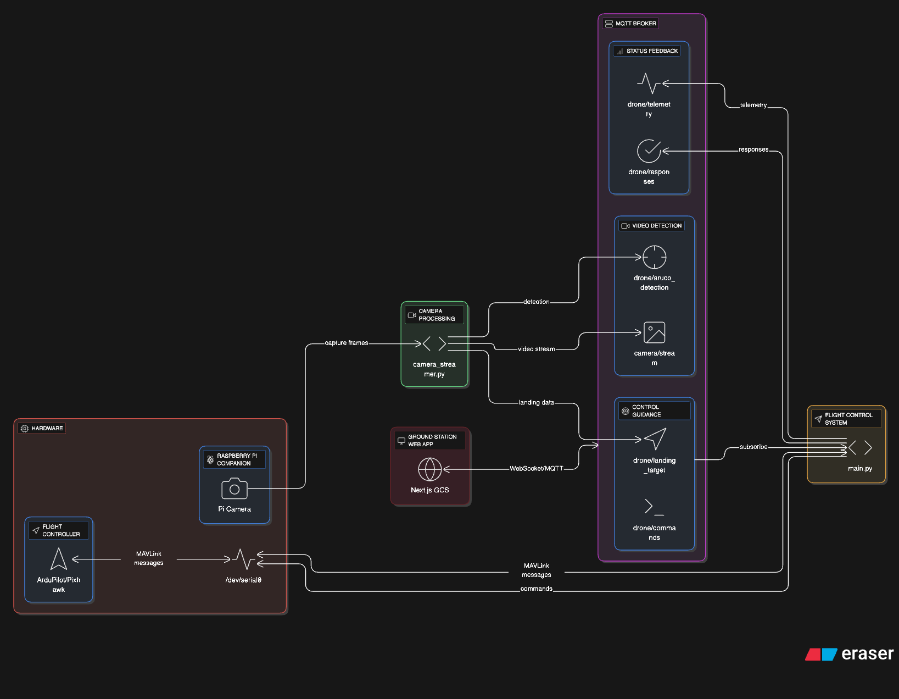

# LACC Drone Project

**Team Members**: Dichill Tomarong, Fahat Yousuf, Paola Ramirez, Sebastian Park, Marco Colin
**Under the Guidance of Professor** Jayesh Bhakta

---

A precision landing drone system featuring ArUco marker detection and a modern web-based ground control station. This project supports both real hardware deployment and ROS Gazebo simulation for development and testing.

## System Architecture

### Real Hardware System

The system uses a Raspberry Pi companion computer connected to a Pixhawk flight controller for autonomous precision landing.



### ROS Simulation System

For testing and development, the system can be run in a ROS Gazebo simulation environment.


### **⚡ Key Differences from ROS Sim:**

| Feature | ROS Simulation | Real Hardware |
|---------|----------------|---------------|
| **Camera** | Gazebo virtual camera → ROS topic | Raspberry Pi Camera → Picamera2 |
| **Connection** | TCP socket (127.0.0.1:5763) | Serial UART (/dev/serial0) |
| **Flight Controller** | SITL (Software in the Loop) | Physical Pixhawk/ArduPilot |
| **Communication** | DroneKit wrapper | Direct PyMAVLink |
| **Environment** | Virtual 3D world | Real world flight |

## Project Structure

```
LACCDRONE/
├── drone-client/          # Drone-side Python scripts
│   ├── main.py           # Flight controller (real hardware)
│   ├── main_ros_sim.py   # Flight controller (ROS simulation)
│   ├── camera_streamer.py           # Camera streamer (real hardware)
│   └── camera_streamer_ros_sim.py   # Camera streamer (ROS simulation)
│
└── ground-station/        # Next.js web application
    ├── app/              # Next.js pages
    ├── components/       # React components
    └── hooks/            # Custom React hooks
```

## Features

- **Precision Landing** - ArUco marker-based landing guidance
- **Manual Control** - Web-based manual flight controls
- **Real-time Telemetry** - Live flight data and status
- **Video Streaming** - Real-time camera feed with marker overlay
- **Ground Station** - Modern web interface for drone control

## Technologies

- **Flight Control**: PyMAVLink, ArduPilot
- **Vision**: OpenCV, ArUco markers, Picamera2
- **Communication**: MQTT, WebSockets
- **Ground Station**: Next.js, React, TypeScript
- **Simulation**: ROS, Gazebo, DroneKit

## Quick Start

Coming soon...

## License

Coming soon...

## Credits
This project is the result of many of the open source projects that were somewhat combined together, without these projects, this would have been really hard to do.

- Caleb - also known as Drone Dojo provides amazing resources on how to make drones especially making precision landing drones, we highly recommend to check out his amazing work! https://dojofordrones.com/
- Carson Stark - https://github.com/Carson-Stark/AutonomousDrone
- Egnchen - https://github.com/egnchen/rasp-cv-tag-detection
- Rosetta Drone - https://github.com/RosettaDrone/vision-landing-2